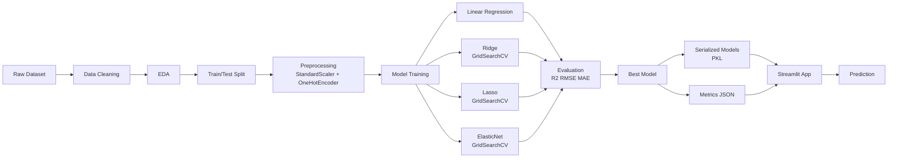

# Insurance Premium Prediction


<p align="center">
  
</p>

An end-to-end machine learning project demonstrating data preprocessing, model training, evaluation, and deployment using Streamlit. Predicts annual medical insurance charges based on demographic and lifestyle factors using four regression algorithms with automated best-model selection.

**Live App → https://rr-insurance-predictor.streamlit.app/**

---

## Features

- Data cleaning and EDA with visual insights (distributions, correlations, outlier detection)
- Feature preprocessing via scikit-learn `Pipeline` + `ColumnTransformer` — zero data leakage
- Four regression models: **Linear Regression**, **Ridge**, **Lasso**, **ElasticNet**
- Hyperparameter tuning with **GridSearchCV** (5-fold cross-validation)
- Automatic best-model selection on app load via `metrics.json`
- Interactive prediction interface with real-time results
- In-app model comparison dashboard, dataset explorer, and visualizations

---

## Results

Linear Regression achieved the best performance on the test set:

| Model | R² Score | RMSE | MAE |
|---|---|---|---|
| **Linear Regression** ⭐ | **0.796** | **$5,940** | **$4,069** |
| Ridge | 0.795 | $5,947 | $4,077 |
| Lasso | 0.795 | $5,952 | $4,076 |
| ElasticNet | 0.794 | $5,967 | $4,100 |

All four models perform comparably — Ridge/Lasso/ElasticNet regularization offers minimal gains on this dataset, suggesting low multicollinearity among features. The Streamlit app automatically highlights and pre-selects the best model.

---

## Architecture

---

## Tech Stack

| Category | Technologies |
|---|---|
| Language | Python 3.10+ |
| Machine Learning | scikit-learn |
| Data Processing | pandas, NumPy |
| Visualization | Matplotlib, Seaborn |
| Web Framework | Streamlit |
| Model Serialization | Joblib |

---

## Dataset

| Property | Detail |
|---|---|
| Source | [Medical Insurance Cost Dataset](https://www.kaggle.com/datasets/mosapabdelghany/medical-insurance-cost-dataset) — Kaggle |
| Original Records | 1,338 |
| After Cleaning | 1,337 (1 duplicate removed) |
| Features | Age, Sex, BMI, Children, Smoker, Region |
| Target | Annual Insurance Charges (USD) |

---

## Project Structure

```text
insurance-premium-prediction/
├── app/
│   └── app.py                          # Streamlit application
├── data/
│   └── raw/
│       └── insurance.csv               # Source dataset (download from Kaggle)
├── images/
│   └── app_preview.png                 # README assets
├── models/
│   ├── linear_regression_pipeline.pkl  # Trained pipelines
│   ├── ridge_pipeline.pkl
│   ├── lasso_pipeline.pkl
│   ├── elasticnet_pipeline.pkl
│   └── metrics.json                    # Auto-generated by the notebook
├── notebooks/
│   └── insurance_eda_model.ipynb       # Full EDA + training notebook
├── requirements.txt
├── .gitignore
└── README.md
```

---

## Quick Start

### 1. Clone and install

```bash
git clone https://github.com/Demon-diablo/insurance-premium-prediction
cd insurance-premium-prediction

python3 -m venv .venv
source .venv/bin/activate        # Windows: .venv\Scripts\activate

pip install -r requirements.txt
```

### 2. Add the dataset

Download `insurance.csv` from [Kaggle](https://www.kaggle.com/datasets/mosapabdelghany/medical-insurance-cost-dataset) and place it at:

```
data/raw/insurance.csv
```

### 3. Train the models

Run the notebook end-to-end to generate all `.pkl` files and `metrics.json`:

```bash
jupyter notebook notebooks/insurance_eda_model.ipynb
```

### 4. Launch the app

```bash
streamlit run app/app.py
```

---

## Future Improvements

- Random Forest and XGBoost for non-linear comparison
- SHAP for feature importance and prediction explainability
- Prediction confidence intervals
- Dockerize the application
- CI/CD pipeline with GitHub Actions

---

## Acknowledgements

Dataset by **Mosap Abdelghany** — [Kaggle](https://www.kaggle.com/datasets/mosapabdelghany/medical-insurance-cost-dataset)
